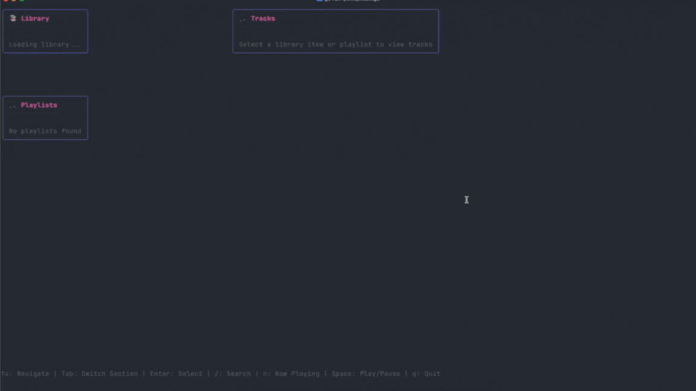

# Spotify TUI

A terminal user interface (TUI) for Spotify built with Go and Bubble Tea.



## Features

- Browse and play your Spotify playlists, Liked Songs, Recently Played, and Saved Albums
- Search for tracks
- Control playback (play/pause, previous)
- View currently playing track
- Terminal interface with playlist sidebar

## Prerequisites

1. Go 1.24+ installed
2. A Spotify Premium account (required for playback control)
3. An active Spotify client (desktop app, web player, or mobile app)

## Setup

### 1. Create a Spotify App

1. Go to [Spotify Developer Dashboard](https://developer.spotify.com/dashboard)
2. Click "Create app"
3. Fill in the app details:
   - App name: "Spotify TUI" (or your preference)
   - App description: "Terminal UI for Spotify"
   - Redirect URI: `http://127.0.0.1:8080/callback`
     - NOTE:  It cannot be `localhost`:  It must be `127.0.0.1`
4. Click "Create"
5. Go to your app settings and note your:
   - Client ID
   - Client Secret

### 2. Download OR Build and Run

You can download a binary for your particular OS and architecture at <https://github.com/jdelnano/spotify-tui/releases/>.

But if you want to build the project yourself, there is a Makefile for common tasks:

```bash
# Install dependencies
go mod download

# Build the application
make build

# Run the application directly
make run

# Or run the built binary
./spotify-tui

# Clean build artifacts
make clean
```

Alternatively, you can use the standard Go commands:

```bash
# Build manually
go build -o spotify-tui

# Run directly
go run ./cmd/main.go
```

On first run, you'll be prompted to enter your Spotify Client ID and Client Secret. These will be saved in `~/.spotify-tui/config.json`.

## Usage

### Navigation

- `↑/↓` or `k/j`: Navigate up/down through lists
- `←/→` or `h/l`: Navigate between panels
- `Enter`: Select playlist or play track
- `/`: Enter search mode
- `n`: View now playing
- `p`: Return to playlist/player view
- `Space`: Play/Pause
- `<`: Previous track
- `q` or `Ctrl+C`: Quit

### Search Mode

- Type to search for tracks
- `Enter`: Execute search
- `p`: Return to playlist/player view
- Use arrow keys to select results
- `Enter`: Play selected track

## Important Notes

- You need to have Spotify open on at least one device for playback to work
- The app uses the Spotify Web API which requires an active Premium account for playback control
- Authentication happens via OAuth2 in your web browser on first run

## Troubleshooting

- **"No active devices found"**: Make sure Spotify is running on at least one device
- **Authentication issues**: Delete `~/.spotify-tui/config.json` and re-authenticate
- **Playback not working**: Ensure you have a Spotify Premium account
